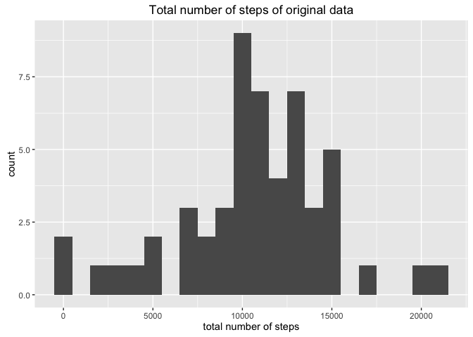
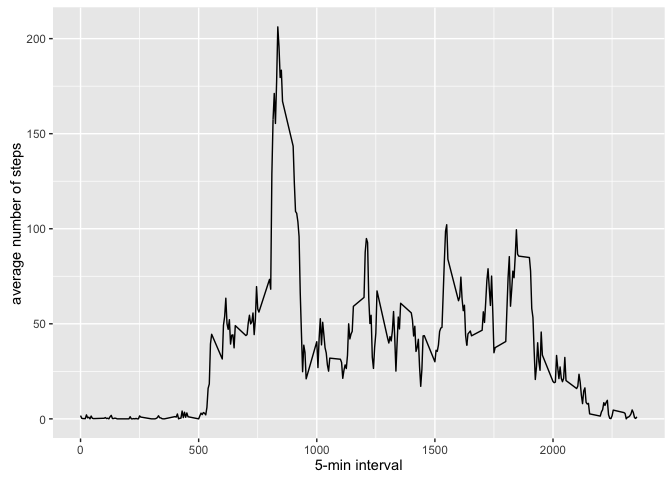
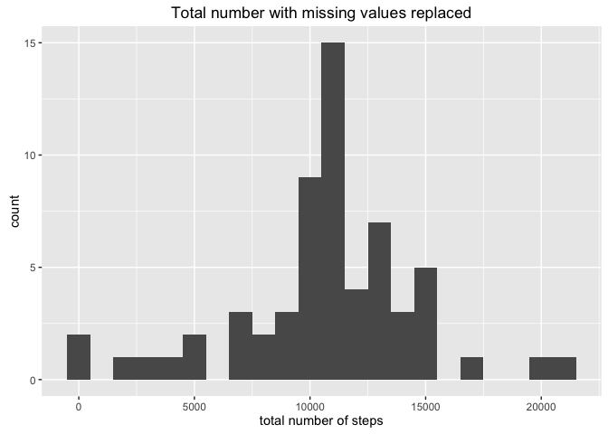
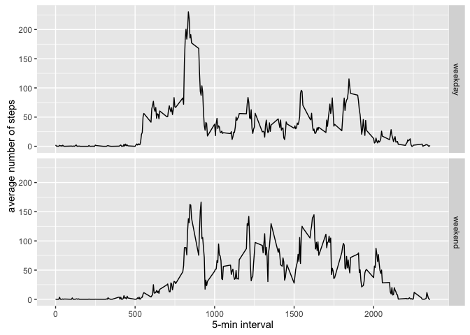

# Reproducible Research: Peer Assessment 1

## Loading packages

```r
library(dplyr)
```

```
## 
## Attaching package: 'dplyr'
```

```
## The following objects are masked from 'package:stats':
## 
##     filter, lag
```

```
## The following objects are masked from 'package:base':
## 
##     intersect, setdiff, setequal, union
```

```r
library(lubridate)
```

```
## 
## Attaching package: 'lubridate'
```

```
## The following object is masked from 'package:base':
## 
##     date
```

```r
library(ggplot2)
```

## Loading and preprocessing the data

```r
unzip("activity.zip", overwrite = TRUE)
dataset <- read.csv("activity.csv")
datasetComplete <- dataset[complete.cases(dataset), ]
```

## What is mean total number of steps taken per day?

```r
by_date <- datasetComplete %>%
    group_by(date) %>%
    summarise(num_steps = sum(steps))
```


```r
ggplot(data = by_date) + 
    geom_histogram(aes(x = num_steps), binwidth = 1000) + 
    xlab("total number of steps") + 
    ylab("count") + 
    ggtitle("Total number of steps of original data")
```

<!-- -->


```r
mean_steps <- mean(by_date$num_steps)
median_steps <- median(by_date$num_steps)
```

The mean and median of the total number of steps taken per day are 1.0766189\times 10^{4}
and 10765, respectively.

## What is the average daily activity pattern?


```r
by_interval <- datasetComplete %>%
    group_by(interval) %>%
    summarise(average_steps = mean(steps))
```


```r
ggplot(data = by_interval) + 
    geom_line(aes(x = interval, y = average_steps)) + 
    xlab("5-min interval") + 
    ylab("average number of steps")
```

<!-- -->


```r
max_steps_index <- which.max(by_interval$average_steps)
max_interval <- by_interval[max_steps_index, ]$interval
max_average_steps <- by_interval[max_steps_index, ]$average_steps
```

On average, across all the days in the dataset, the 5-minute interval that 
contains the maximum number of steps is the 835 interval.

## Imputing missing values


```r
na_number <- sum(!complete.cases(dataset))
```

The total number of missing values in the original data set is 2304.

The missing values in the data set will be filled in using the average number of 
steps of the 5-min interval accross all the days. In order to determine the mean
of the number of steps, we group the original data by interval, and summarise by introducing a new column that shows the average number of steps taken for every 
5-min interval.


```r
na_filling_data <- dataset %>%
    group_by(interval) %>%
    summarise(mean_steps = mean(steps, na.rm = TRUE))
```

A data set that contains the data to replace the NA values is created:

```r
replaced_data <- dataset[!complete.cases(dataset), ] %>%
    left_join(na_filling_data, by = "interval") %>% 
    mutate(steps = mean_steps) %>%
    select(steps, date, interval)
```

A new dataset called new_data that is equal to the original dataset but with the 
missing data filled in is created:

```r
new_data <- datasetComplete %>%
    rbind(replaced_data) %>%
    arrange(date)
```

Histogram of the total number of steps taken each day:

```r
steps_per_day <- new_data %>%
    group_by(date) %>%
    summarise(num_steps = sum(steps))

ggplot(data = steps_per_day) + 
    geom_histogram(aes(x = num_steps), binwidth = 1000) + 
    xlab("total number of steps") + 
    ylab("count") + 
    ggtitle("Total number with missing values replaced")
```

<!-- -->


```r
mean_steps <- mean(steps_per_day$num_steps)
median_steps <- median(steps_per_day$num_steps)
```

The mean and median of the total number of steps taken per day are 1.0766189\times 10^{4}
and 1.0766189\times 10^{4}, respectively. The median is larger now with the missing data
filled in, whereas the mean remains the same. The total number of steps is going
to increase due to the fact that the values that replace the missing data are all
positive.

## Are there differences in activity patterns between weekdays and weekends?


```r
day_of_week <- function(date) {
    weekend <- c("Sat", "Sun")
    if (wday(date, label = TRUE) %in% weekend) {
        "weekend"
    }
    else 
        "weekday"
}
```


```r
day_vector <- function(vector){
    factor(sapply(vector, day_of_week))
}
```


```r
patterns <- new_data %>%
    mutate(day_of_week = day_vector(date)) %>%
    group_by(day_of_week, interval) %>%
    summarise(average_steps = mean(steps))
```


```r
ggplot(data = patterns) + 
    geom_line(aes(x = interval, y = average_steps)) + 
    xlab("5-min interval") + 
    ylab("average number of steps") + 
    facet_grid(day_of_week~.)
```

<!-- -->

The plot suggests that, on average, there is an increase in activity on weekends
between the intervals 1000 and 2000. However, the maximum number of steps across 
all 5-min intervals is higher on weekdays.


